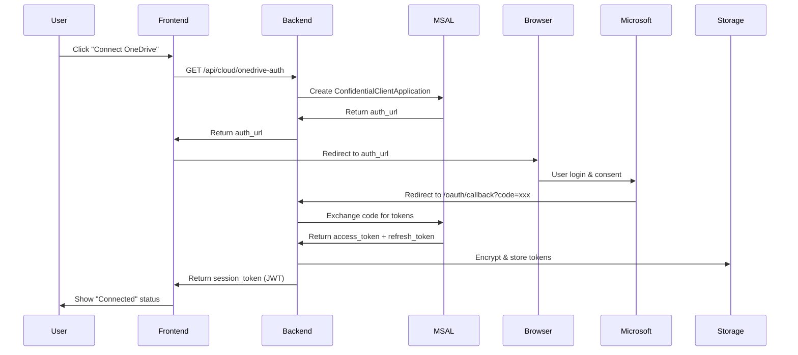

# 📘 OneDrive Integration - Detailed Implementation Plan

**Provider**: Microsoft OneDrive / OneDrive for Business
**Lộ trình**: 1 - General Cloud Storage
**Priority**: Medium (implement thứ 2 sau Dropbox)
**Timeline**: 3-4 ngày làm việc
**Độ khó**: ⭐⭐ Medium
**Status**: Planning
**Last Updated**: 2025-11-19

---

## 1. TỔNG QUAN & MỤC TIÊU

### 1.1 Use Case
- User có Office 365 subscription với OneDrive storage
- User tự upload video camera lên OneDrive để tổ chức theo folder
- Cần download video về VPACK để phân tích batch

### 1.2 Ưu Điểm OneDrive
- ✅ Phổ biến trong doanh nghiệp (Office 365)
- ✅ Dung lượng lớn (1TB với Office 365)
- ✅ Microsoft Graph API mature và well-documented
- ✅ OAuth2 chuẩn với Microsoft Identity Platform
- ✅ SDK chính thức cho Python

### 1.3 Technical Specs
- **API**: Microsoft Graph API v1.0
- **Authentication**: OAuth2 với Microsoft Identity Platform (MSAL)
- **SDK**: `msal` (Microsoft Authentication Library) + `requests`
- **Scopes Required**:
  - `Files.Read` - Đọc files
  - `Files.Read.All` - Đọc all files (nếu cần)
  - `User.Read` - User profile info
  - `offline_access` - Refresh token

### 1.4 Deliverables
1. ✅ OAuth2 authentication flow working
2. ✅ Folder tree listing (lazy load)
3. ✅ Video file download
4. ✅ Auto-sync integration
5. ✅ Frontend React component
6. ✅ Tests (unit + integration)
7. ✅ Documentation

---

## 2. PREREQUISITES & SETUP

### 2.1 Tài Khoản Cần Có
- [ ] **Microsoft account** (cá nhân) - Free
  - Hoặc Office 365 account (nếu có)
  - OneDrive free: 5GB storage

### 2.2 Azure App Registration
**Bước cần User làm:**

1. Truy cập **Azure Portal**: https://portal.azure.com
2. Vào **Azure Active Directory** > **App registrations**
3. Click **New registration**:
   - **Name**: `VPACK OneDrive Integration`
   - **Supported account types**:
     - Chọn `Accounts in any organizational directory and personal Microsoft accounts`
   - **Redirect URI**:
     - Platform: `Web`
     - URI: `http://localhost:8080/api/cloud/onedrive/oauth/callback`
4. Click **Register**

5. Sau khi register, lấy thông tin sau:
   - **Application (client) ID** - Copy và lưu lại
   - **Directory (tenant) ID** - Copy và lưu lại

6. Tạo **Client Secret**:
   - Vào tab **Certificates & secrets**
   - Click **New client secret**
   - Description: `VPACK OneDrive Secret`
   - Expires: `24 months`
   - Click **Add**
   - **Copy secret value ngay** (chỉ hiện 1 lần!)

7. Configure **API permissions**:
   - Vào tab **API permissions**
   - Click **Add a permission** > **Microsoft Graph** > **Delegated permissions**
   - Thêm permissions:
     - `Files.Read`
     - `Files.Read.All`
     - `User.Read`
     - `offline_access`
   - Click **Grant admin consent** (nếu có quyền admin)

8. Lưu credentials vào file:
   ```bash
   # File: backend/modules/sources/credentials/onedrive_credentials.json
   {
     "client_id": "YOUR_CLIENT_ID",
     "client_secret": "YOUR_CLIENT_SECRET",
     "tenant_id": "common",
     "authority": "https://login.microsoftonline.com/common",
     "redirect_uri": "http://localhost:8080/api/cloud/onedrive/oauth/callback"
   }
   ```

### 2.3 Dependencies Installation
```bash
pip install msal==1.26.0
pip install requests==2.31.0
# msal = Microsoft Authentication Library for Python
```

### 2.4 Environment Variables (Optional)
```bash
# .env file (nếu không dùng credentials file)
ONEDRIVE_CLIENT_ID=your_client_id
ONEDRIVE_CLIENT_SECRET=your_client_secret
ONEDRIVE_TENANT_ID=common
```

---

## 3. KIẾN TRÚC & IMPLEMENTATION

### 3.1 File Structure
```
backend/modules/sources/
├── onedrive_auth.py           # OAuth2 authentication với MSAL
├── onedrive_client.py         # OneDrive Graph API client
├── credentials/
│   └── onedrive_credentials.json
└── tokens/
    └── onedrive_{user_hash}.json   # Encrypted tokens
```

### 3.2 Authentication Flow



### 3.3 Core Components

#### **Component 1: `onedrive_auth.py`**
Chức năng:
- Initiate OAuth2 flow với MSAL
- Handle callback và exchange code
- Store/load encrypted tokens
- Auto-refresh expired tokens

Key methods:
```python
class OneDriveAuthManager:
    def __init__(self):
        self.client_id = ...
        self.client_secret = ...
        self.authority = "https://login.microsoftonline.com/common"
        self.scopes = ["Files.Read", "Files.Read.All", "User.Read", "offline_access"]

    def initiate_oauth_flow(self) -> Dict:
        """Create MSAL app and get authorization URL"""

    def complete_oauth_flow(self, code: str) -> Dict:
        """Exchange code for tokens"""

    def load_cached_token(self, user_email: str) -> Optional[Dict]:
        """Load and refresh token if needed"""

    def get_access_token(self, user_email: str) -> Optional[str]:
        """Get valid access token (auto-refresh if expired)"""
```

#### **Component 2: `onedrive_client.py`**
Chức năng:
- List folders/files via Microsoft Graph API
- Download video files
- Get user info

Key methods:
```python
class OneDriveClient:
    GRAPH_API_ENDPOINT = "https://graph.microsoft.com/v1.0"

    def __init__(self, access_token: str):
        self.access_token = access_token
        self.headers = {"Authorization": f"Bearer {access_token}"}

    def get_user_info(self) -> Dict:
        """GET /me"""

    def list_root_items(self) -> List[Dict]:
        """GET /me/drive/root/children"""

    def list_folder_items(self, folder_id: str) -> List[Dict]:
        """GET /me/drive/items/{folder_id}/children"""

    def get_folder_by_path(self, path: str) -> Dict:
        """GET /me/drive/root:/{path}"""

    def download_file(self, file_id: str, local_path: str):
        """GET /me/drive/items/{file_id}/content"""

    def search_videos(self, folder_id: str = None) -> List[Dict]:
        """Search for video files (mp4, avi, mov, etc.)"""
```

#### **Component 3: API Endpoints** (thêm vào `cloud_endpoints.py`)
```python
@app.route('/api/cloud/onedrive-auth', methods=['POST'])
@limiter.limit("10 per minute")
def onedrive_initiate_auth():
    """Initiate OneDrive OAuth2 flow"""

@app.route('/api/cloud/onedrive/oauth/callback', methods=['GET'])
def onedrive_oauth_callback():
    """Handle OAuth2 callback from Microsoft"""

@app.route('/api/cloud/onedrive/auth-status', methods=['GET'])
@limiter.limit("30 per minute")
def onedrive_auth_status():
    """Check OneDrive authentication status"""

@app.route('/api/cloud/onedrive/list_folders', methods=['POST'])
@limiter.limit("15 per minute")
def onedrive_list_folders():
    """List OneDrive folders (lazy load)"""

@app.route('/api/cloud/onedrive/disconnect', methods=['POST'])
def onedrive_disconnect():
    """Disconnect OneDrive and revoke tokens"""
```

#### **Component 4: Frontend** (`OneDriveFolderTree.tsx`)
```typescript
interface OneDriveFolderTreeProps {
    session_token?: string;
    onFoldersSelected: (folders: SelectedFolder[]) => void;
    maxDepth?: number;
}

// Features:
// - Lazy loading folders on expand
// - Video file count per folder
// - Checkbox selection
// - Depth limitation
// - Loading states
```

---

## 4. CHI TIẾT IMPLEMENTATION

### 4.1 Phase 1: Authentication (Ngày 1 - buổi sáng)

**Task 1.1**: Setup credentials file
```bash
# Create file structure
mkdir -p backend/modules/sources/credentials
touch backend/modules/sources/credentials/onedrive_credentials.json
```

**Task 1.2**: Implement `onedrive_auth.py`
- Install `msal` library
- Create `OneDriveAuthManager` class
- Implement `initiate_oauth_flow()` method
- Implement `complete_oauth_flow()` method
- Implement token encryption/decryption (reuse existing utilities)

**Task 1.3**: Test authentication flow
```python
# Manual test script
from onedrive_auth import OneDriveAuthManager

auth_manager = OneDriveAuthManager()
result = auth_manager.initiate_oauth_flow()
print(f"Visit: {result['auth_url']}")
# User visits URL and copies code
code = input("Enter code: ")
tokens = auth_manager.complete_oauth_flow(code)
print(f"Access token: {tokens['access_token'][:20]}...")
```

**Expected output**: Valid access token received

---

### 4.2 Phase 2: Client Implementation (Ngày 1 - buổi chiều + Ngày 2 sáng)

**Task 2.1**: Implement `onedrive_client.py`
- Create `OneDriveClient` class
- Implement `get_user_info()` - Test API connection
- Implement `list_root_items()` - List root folders
- Implement `list_folder_items(folder_id)` - List subfolder items

**Task 2.2**: Test folder listing
```python
from onedrive_client import OneDriveClient
from onedrive_auth import OneDriveAuthManager

auth_manager = OneDriveAuthManager()
token = auth_manager.get_access_token("user@example.com")

client = OneDriveClient(token)
user_info = client.get_user_info()
print(f"User: {user_info['displayName']}")

folders = client.list_root_items()
print(f"Found {len(folders)} items in root")
```

**Task 2.3**: Implement video file filtering
- Filter by MIME types: `video/mp4`, `video/avi`, `video/quicktime`, etc.
- Implement `search_videos()` method
- Handle pagination (Graph API returns max 200 items per page)

**Task 2.4**: Implement file download
- Implement `download_file(file_id, local_path)`
- Add progress tracking
- Add error handling (network errors, file not found, etc.)

---

### 4.3 Phase 3: API Endpoints (Ngày 2 - buổi chiều)

**Task 3.1**: Add OneDrive to `cloud_manager.py`
```python
SUPPORTED_PROVIDERS = {
    'google_drive': {...},
    'onedrive': {
        'name': 'Microsoft OneDrive',
        'client_class': OneDriveClient,
        'auth_type': 'oauth2',
        'supports_folders': True,
        'supports_nested': True,
        'auth_manager': OneDriveAuthManager
    }
}
```

**Task 3.2**: Implement API endpoints
- `/api/cloud/onedrive-auth` - Initiate OAuth
- `/api/cloud/onedrive/oauth/callback` - Handle callback
- `/api/cloud/onedrive/auth-status` - Check auth status
- `/api/cloud/onedrive/list_folders` - List folders

**Task 3.3**: Test endpoints với Postman/curl
```bash
# Test auth initiation
curl -X POST http://localhost:8080/api/cloud/onedrive-auth

# Test auth status (with session token)
curl -X GET http://localhost:8080/api/cloud/onedrive/auth-status \
  -H "Cookie: session_token=xxx"

# Test folder listing
curl -X POST http://localhost:8080/api/cloud/onedrive/list_folders \
  -H "Cookie: session_token=xxx" \
  -d '{"folder_id": "root"}'
```

---

### 4.4 Phase 4: Frontend Integration (Ngày 3 - cả ngày)

**Task 4.1**: Create `OneDriveFolderTree.tsx`
- Copy structure từ `GoogleDriveFolderTree.tsx`
- Adapt cho OneDrive API response format
- Update icon và branding

**Task 4.2**: Add OneDrive option to source type selector
```typescript
// In AddSource modal
<option value="onedrive">Microsoft OneDrive</option>
```

**Task 4.3**: Test frontend flow
1. Click "Add Source" > Select "OneDrive"
2. Click "Connect OneDrive"
3. OAuth popup opens → User logs in
4. Callback redirects back → Shows folder tree
5. Select folders → Save source

---

### 4.5 Phase 5: Auto-Sync Integration (Ngày 4 - sáng)

**Task 5.1**: Extend `pydrive_downloader.py` để support OneDrive
- Hoặc tạo `cloud_downloader.py` generic
- Support multiple providers

**Task 5.2**: Implement sync logic
```python
def sync_onedrive_source(source_id: int):
    # Load source config
    source = get_source_by_id(source_id)

    # Get OneDrive client
    auth_manager = OneDriveAuthManager()
    token = auth_manager.get_access_token(source.user_email)
    client = OneDriveClient(token)

    # List videos in selected folders
    videos = client.search_videos(folder_id=source.folder_id)

    # Download new videos (dedup by file_id)
    for video in videos:
        if not is_already_downloaded(video['id']):
            client.download_file(video['id'], local_path)
            track_downloaded_file(source_id, video)
```

**Task 5.3**: Test auto-sync
- Manually trigger sync
- Check videos downloaded
- Check database tracking

---

### 4.6 Phase 6: Testing (Ngày 4 - chiều)

**Task 6.1**: Unit Tests
```python
# tests/test_onedrive_auth.py
def test_initiate_oauth_flow():
    auth_manager = OneDriveAuthManager()
    result = auth_manager.initiate_oauth_flow()
    assert 'auth_url' in result
    assert 'login.microsoftonline.com' in result['auth_url']

# tests/test_onedrive_client.py
def test_list_root_items(mock_access_token):
    client = OneDriveClient(mock_access_token)
    items = client.list_root_items()
    assert isinstance(items, list)
```

**Task 6.2**: Integration Tests
```python
# tests/integration/test_onedrive_flow.py
def test_full_oauth_flow():
    # Test với real credentials (test account)
    ...
```

**Task 6.3**: Manual E2E Test
- [ ] Auth flow works end-to-end
- [ ] Folder tree loads correctly
- [ ] Video files detected
- [ ] Download works
- [ ] Auto-sync works
- [ ] Token refresh works

---

## 5. DATABASE SCHEMA

### 5.1 Extend `video_sources` Table
```sql
-- No schema changes needed, use existing structure:
-- config column (JSON) will store OneDrive-specific data

-- Example config:
{
  "provider": "onedrive",
  "folder_id": "01ABCDEF1234567890",
  "folder_name": "Camera Videos",
  "user_email": "user@example.com",
  "drive_type": "personal" // or "business"
}
```

### 5.2 Extend `downloaded_files` Table
```sql
-- Add provider-specific ID tracking
ALTER TABLE downloaded_files ADD COLUMN IF NOT EXISTS cloud_file_id TEXT;
CREATE INDEX IF NOT EXISTS idx_cloud_file_id ON downloaded_files(cloud_file_id);

-- OneDrive file_id example: "01ABCDEF1234567890ABCDEF!123"
```

---

## 6. SECURITY & ERROR HANDLING

### 6.1 Security Checklist
- [x] Client secret stored encrypted
- [x] Access tokens stored encrypted (AES-256)
- [x] JWT session tokens with expiration
- [x] HTTPS only for OAuth redirect
- [x] State parameter for CSRF protection
- [x] Rate limiting on API endpoints
- [x] Audit logging for auth events

### 6.2 Error Scenarios & Handling

| Error | Scenario | Handling |
|-------|----------|----------|
| **Invalid credentials** | Client ID/secret wrong | Show clear error message, link to setup guide |
| **Token expired** | Access token expired | Auto-refresh with refresh_token |
| **Refresh token expired** | User needs to re-auth | Prompt user to re-authenticate |
| **Network error** | Can't reach Graph API | Retry with exponential backoff (3 attempts) |
| **File not found** | Video deleted on OneDrive | Skip file, log warning |
| **Quota exceeded** | OneDrive storage full | Show warning to user |
| **Rate limit** | Too many API calls | Backoff and retry, implement caching |

### 6.3 Error Logging
```python
import logging

logger = logging.getLogger('onedrive_integration')

try:
    result = client.list_folder_items(folder_id)
except requests.exceptions.HTTPError as e:
    if e.response.status_code == 401:
        logger.error("OneDrive: Unauthorized - token expired")
        # Trigger token refresh
    elif e.response.status_code == 429:
        logger.warning("OneDrive: Rate limit exceeded")
        # Backoff and retry
    else:
        logger.error(f"OneDrive API error: {e}")
```

---

## 7. TESTING STRATEGY

### 7.1 Unit Tests (Target: >80% coverage)
```python
# tests/test_onedrive_auth.py
- test_initiate_oauth_flow()
- test_complete_oauth_flow_success()
- test_complete_oauth_flow_invalid_code()
- test_token_encryption_decryption()
- test_token_refresh()

# tests/test_onedrive_client.py
- test_get_user_info()
- test_list_root_items()
- test_list_folder_items()
- test_download_file()
- test_search_videos()
- test_pagination_handling()
```

### 7.2 Integration Tests
```python
# tests/integration/test_onedrive_e2e.py
- test_full_authentication_flow()
- test_folder_listing_with_real_account()
- test_video_download_with_real_file()
```

### 7.3 Manual Testing Checklist
- [ ] Create test OneDrive account
- [ ] Upload sample videos to OneDrive (mp4, avi)
- [ ] Test OAuth flow in browser
- [ ] Test folder tree rendering
- [ ] Test video download
- [ ] Test auto-sync with 5+ videos
- [ ] Test token refresh (manually expire token)
- [ ] Test error scenarios (invalid credentials, network error)

---

## 8. DOCUMENTATION & DEPLOYMENT

### 8.1 Code Documentation
- [ ] Docstrings cho tất cả classes và methods
- [ ] Inline comments cho complex logic
- [ ] Type hints cho tất cả functions

### 8.2 API Documentation
```markdown
# OneDrive API Endpoints

## POST /api/cloud/onedrive-auth
Initiate OneDrive OAuth2 flow

**Request**: None
**Response**:
{
  "success": true,
  "auth_url": "https://login.microsoftonline.com/common/oauth2/v2.0/authorize?...",
  "session_id": "uuid"
}

## GET /api/cloud/onedrive/oauth/callback
OAuth2 callback endpoint (auto-redirect)

## GET /api/cloud/onedrive/auth-status
Check authentication status

**Headers**: Cookie: session_token=xxx
**Response**:
{
  "authenticated": true,
  "user_email": "user@example.com",
  "user_name": "John Doe"
}
```

### 8.3 User Guide
```markdown
# How to Connect OneDrive to VPACK

1. Prerequisites:
   - Microsoft account with OneDrive
   - Video files uploaded to OneDrive

2. Setup Steps:
   - Click "Add Source" > Select "OneDrive"
   - Click "Connect OneDrive"
   - Login with your Microsoft account
   - Grant permissions to VPACK
   - Select folders containing videos
   - Click "Save"

3. Auto-sync:
   - Enable auto-sync in source settings
   - Videos will download automatically every N minutes
```

### 8.4 Deployment Checklist
- [ ] Environment variables configured
- [ ] Credentials files in place
- [ ] Database migrations run
- [ ] Dependencies installed (`pip install msal requests`)
- [ ] Rate limiting configured
- [ ] Logging configured
- [ ] HTTPS enabled for OAuth redirect
- [ ] Test với production credentials

### 8.5 Rollback Plan
If issues occur:
1. Disable OneDrive option in frontend (feature flag)
2. Revert database migrations if needed
3. Keep existing Google Drive functionality working
4. Fix issues in dev environment
5. Re-deploy when ready

---

## 9. SUCCESS CRITERIA

### 9.1 Functional Requirements
- [x] User can authenticate with OneDrive via OAuth2
- [x] User can browse OneDrive folder tree
- [x] User can select folders containing videos
- [x] System can download videos from OneDrive
- [x] Auto-sync works for OneDrive sources
- [x] Token refresh works automatically

### 9.2 Non-Functional Requirements
- [x] Authentication success rate: >95%
- [x] Download success rate: >90%
- [x] Test coverage: >80%
- [x] Response time: <2s for folder listing
- [x] No credentials exposed in logs or frontend

### 9.3 Acceptance Criteria
- [ ] All unit tests pass
- [ ] Integration tests pass
- [ ] Manual E2E test successful
- [ ] Code reviewed and approved
- [ ] Documentation complete
- [ ] User guide written

---

## 10. RISKS & MITIGATION

| Risk | Impact | Probability | Mitigation |
|------|--------|-------------|------------|
| **Microsoft API changes** | High | Low | Use stable v1.0 API, monitor changelog |
| **Token expiration issues** | Medium | Medium | Robust refresh logic, user notifications |
| **Rate limiting** | Medium | High | Implement caching, backoff strategies |
| **Large file downloads** | Medium | Medium | Stream downloads, progress tracking |
| **OneDrive Business differences** | Medium | Low | Test with both personal & business accounts |

---

## 11. NEXT STEPS AFTER COMPLETION

1. ✅ **OneDrive complete** → Move to Dropbox integration
2. Monitor OneDrive usage in production
3. Collect user feedback
4. Optimize performance if needed
5. Add advanced features:
   - Shared drives support (OneDrive for Business)
   - Selective sync (filter by date, size, etc.)
   - Bandwidth throttling for downloads

---

**Estimated Effort**: 3-4 days
**Actual Effort**: _[To be filled after completion]_
**Status**: Planning → Ready for Implementation
**Assignee**: _[Developer name]_
**Reviewer**: _[Reviewer name]_

---

**Prepared by**: Claude (AI Assistant)
**Date**: 2025-11-19
**Version**: 1.0
