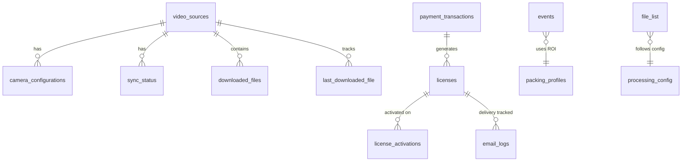
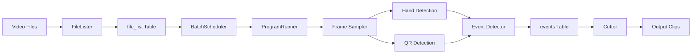
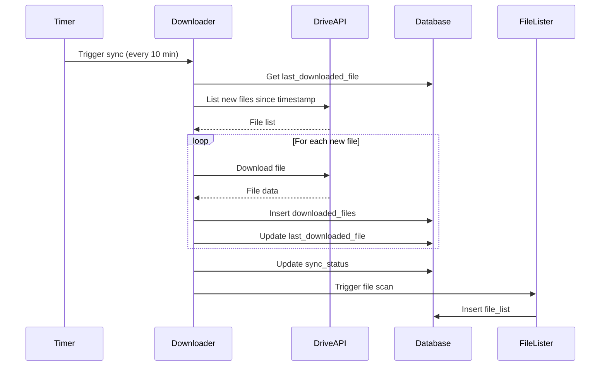
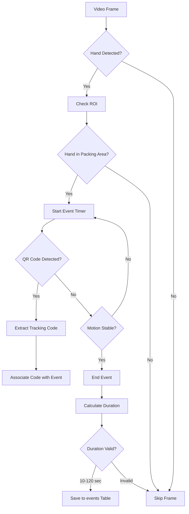
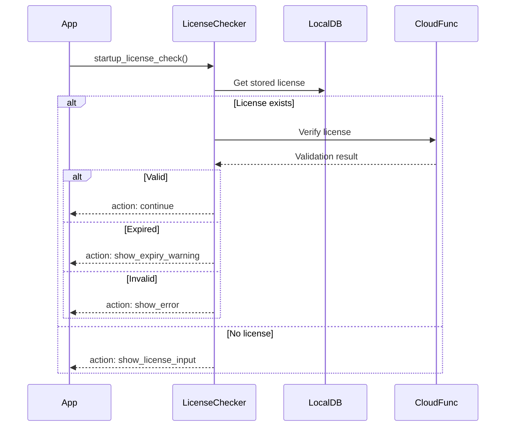

# ePACK Architecture Overview

**Version**: 2.1.1
**Last Updated**: 2025-10-07
**Document Type**: Technical Architecture Reference
**Recent Changes**: React 19 Stable Upgrade

---

## Table of Contents

1. [System Architecture Overview](#system-architecture-overview)
2. [Technology Stack](#technology-stack)
3. [Database Schema](#database-schema)
4. [Backend Module Structure](#backend-module-structure)
5. [Frontend Architecture](#frontend-architecture)
6. [Data Flow Diagrams](#data-flow-diagrams)
7. [Key Integration Points](#key-integration-points)
8. [Design Patterns & Best Practices](#design-patterns--best-practices)
9. [Performance & Scalability](#performance--scalability)

---

## System Architecture Overview

ePACK is a desktop application for automated video processing, event detection, and tracking code analysis. The system follows a **client-server architecture** with a React frontend and Flask backend.

### High-Level Component Diagram

```
┌─────────────────────────────────────────────────────────────────┐
│                    Frontend Layer (Port 3000)                   │
│                       Next.js 15.1.6                            │
├─────────────────────────────────────────────────────────────────┤
│  • Dashboard (Program Control)                                  │
│  • ROI Configuration (Step 4)                                   │
│  • Trace Tracking (Real-time Analysis)                          │
│  • Configuration Wizard (5-Step Setup)                          │
│  • Payment & License Management                                 │
└────────────────────────┬────────────────────────────────────────┘
                         │ REST API + WebSocket (CORS)
┌────────────────────────▼────────────────────────────────────────┐
│                    Backend Layer (Port 8080)                    │
│                       Flask 3.0.0                               │
├─────────────────────────────────────────────────────────────────┤
│  ┌──────────────────────────────────────────────────────────┐  │
│  │ API Blueprints (REST Endpoints)                          │  │
│  │ • program_bp: Processing control                         │  │
│  │ • roi_bp: ROI configuration                              │  │
│  │ • hand_detection_bp: AI detection                        │  │
│  │ • qr_detection_bp: QR code scanning                      │  │
│  │ • cloud_bp: Cloud sync                                   │  │
│  │ • payment_bp: License management                         │  │
│  │ • config_bp: System configuration                        │  │
│  └──────────────────────────────────────────────────────────┘  │
│                                                                  │
│  ┌──────────────────────────────────────────────────────────┐  │
│  │ Core Modules                                             │  │
│  │ • scheduler: Batch processing & job orchestration        │  │
│  │ • technician: CV processing (hand, QR, ROI)              │  │
│  │ • sources: Multi-source video management                 │  │
│  │ • license: RSA license validation                        │  │
│  │ • payments: PayOS integration                            │  │
│  │ • config: System configuration                           │  │
│  │ • db_utils: Thread-safe database operations              │  │
│  └──────────────────────────────────────────────────────────┘  │
└────────────────────────┬────────────────────────────────────────┘
                         │
┌────────────────────────▼────────────────────────────────────────┐
│                   Data Layer (SQLite WAL)                       │
│          /Users/annhu/vtrack_app/ePACK/backend/database/      │
├─────────────────────────────────────────────────────────────────┤
│  events.db (23 tables, 50+ indexes, 4 views)                   │
│  • Core: events, file_list, processing_config                  │
│  • Sources: video_sources, camera_configurations               │
│  • Sync: sync_status, downloaded_files                         │
│  • Security: user_sessions, auth_audit                         │
│  • License: licenses, license_activations                      │
│  • Platform: platform_column_mappings                          │
│  • Timezone: timezone_metadata, camera_configs                 │
└─────────────────────────────────────────────────────────────────┘
```

### System Layers

| Layer | Technology | Responsibility | Port |
|-------|-----------|----------------|------|
| **Presentation** | Next.js 15.1.6 + Chakra UI | User interface, real-time updates | 3000 |
| **API Gateway** | Flask 3.0.0 + Flask-CORS | REST endpoints, request routing | 8080 |
| **Business Logic** | Python modules | Video processing, event detection | - |
| **Data Access** | SQLite + WAL mode | Persistent storage, concurrency | - |
| **External Services** | Google OAuth, PayOS, Cloud Functions | Authentication, payments, licensing | - |

---

## Technology Stack

### Frontend Stack

```yaml
Framework: Next.js 15.1.6 (App Router)
Language: TypeScript 4.9.5
UI Library: Chakra UI 2.8.2
React Version: 19.2.0 (Stable) ← Upgraded 2025-10-07
Styling:
  - Emotion (CSS-in-JS)
  - Tailwind CSS 3.x
State Management: React Context API
Animation: Framer Motion
HTTP Client: Axios / Fetch API
Real-time: WebSocket (for progress updates)
```

**Key Dependencies**:
- `react@19.2.0` - Core framework (Stable)
- `react-dom@19.2.0` - DOM rendering
- `next@15.1.6` - Server-side rendering
- `@chakra-ui/react@2.8.2` - Component library
- `@emotion/react@11.4.1` - CSS-in-JS styling
- `framer-motion@4.1.17` - Animations
- `typescript@4.9.5` - Type safety

**React 19 Migration Notes** (2025-10-07):
- Upgraded from RC.1 to stable release (19.2.0)
- Fixed 10+ TypeScript strict type checking errors
- Chakra UI 2.8.2 compatible but not fully optimized
- All production features tested and working
- npm configuration cleaned (removed pnpm-specific settings)

### Backend Stack

```yaml
Framework: Flask 3.0.0
Language: Python 3.8+
Database: SQLite 3.x (WAL mode)
Computer Vision:
  - OpenCV 4.x (cv2)
  - MediaPipe 0.10.x (hand detection)
  - pyzbar (QR code detection)
Cloud Integration: PyDrive2 1.15.4
Authentication: Google OAuth 2.0
Task Scheduling: APScheduler 3.x
License System: cryptography (RSA, Fernet)
Payment Gateway: PayOS
```

**Key Dependencies**:
- `Flask==3.0.0` - Web framework
- `Flask-CORS==4.0.0` - Cross-origin resource sharing
- `opencv-python==4.8.1.78` - Computer vision
- `mediapipe==0.10.8` - Hand landmark detection
- `PyDrive2==1.15.4` - Google Drive API
- `APScheduler==3.10.4` - Background job scheduling
- `cryptography==41.0.7` - License encryption
- `google-auth==2.25.2` - OAuth 2.0

### Database Configuration

```python
# SQLite with Write-Ahead Logging (WAL)
PRAGMA journal_mode = WAL          # Concurrent reads/writes
PRAGMA synchronous = NORMAL        # Balanced performance
PRAGMA busy_timeout = 60000        # 60-second timeout
PRAGMA temp_store = MEMORY         # In-memory temp storage
PRAGMA foreign_keys = ON           # Enforce relationships
```

---

## Database Schema

### Schema Overview

ePACK uses a **single SQLite database** (`events.db`) with 23 tables organized into 7 functional domains:

1. **Core Processing** (4 tables)
2. **Video Sources & Sync** (6 tables)
3. **Security & Authentication** (3 tables)
4. **License Management** (4 tables)
5. **Platform Management** (1 table)
6. **Timezone Management** (2 tables)
7. **Configuration** (3 tables)

### Database File Location

```
/Users/annhu/vtrack_app/ePACK/backend/database/events.db
```

**Schema Definition**: `/Users/annhu/vtrack_app/ePACK/backend/database.py`

---

### Core Processing Tables

#### 1. `events` - Detected Packing Events

**Purpose**: Stores all detected packing events with timestamps and tracking codes.

| Column | Type | Description | Constraints |
|--------|------|-------------|-------------|
| `event_id` | INTEGER | Primary key | PRIMARY KEY AUTOINCREMENT |
| `ts` | INTEGER | Start time (ms since epoch) | |
| `te` | INTEGER | End time (ms since epoch) | |
| `duration` | INTEGER | Duration in seconds | |
| `tracking_codes` | TEXT | JSON array of QR codes | |
| `video_file` | TEXT | Source video path | NOT NULL |
| `buffer` | INTEGER | Video buffer in seconds | NOT NULL |
| `camera_name` | TEXT | Camera identifier | |
| `packing_time_start` | INTEGER | Packing start (UTC ms) | |
| `packing_time_end` | INTEGER | Packing end (UTC ms) | |
| `is_processed` | INTEGER | Processing status (0/1) | DEFAULT 0 |
| `processed_timestamp` | INTEGER | Processing completion time | |
| `output_video_path` | TEXT | Generated clip path | |
| `session_id` | TEXT | Processing session ID | |
| `output_file` | TEXT | Output filename | |
| `timezone_info` | TEXT | JSON timezone metadata | |
| `created_at_utc` | INTEGER | Creation timestamp (UTC ms) | |
| `updated_at_utc` | INTEGER | Last update (UTC ms) | |

**Indexes**:
- `idx_events_te_event_id` ON `(te, event_id)`
- `idx_events_timezone_camera` ON `(camera_name, packing_time_start)`
- `idx_events_packing_time_utc` ON `(packing_time_start, packing_time_end)`
- `idx_events_processed_timezone` ON `(is_processed, packing_time_start, camera_name)`
- `idx_events_created_utc` ON `(created_at_utc)`
- `idx_events_updated_utc` ON `(updated_at_utc)`

**Example Record**:
```json
{
  "event_id": 1234,
  "ts": 1696234567000,
  "te": 1696234590000,
  "duration": 23,
  "tracking_codes": "[\"TRACK123\", \"TRACK456\"]",
  "video_file": "/path/to/video.mp4",
  "camera_name": "Cam1",
  "packing_time_start": 1696234567000,
  "packing_time_end": 1696234590000,
  "timezone_info": "{\"tz\": \"Asia/Ho_Chi_Minh\", \"offset\": 7.0}"
}
```

#### 2. `file_list` - Video Processing Queue

**Purpose**: Tracks all video files pending or completed processing.

| Column | Type | Description | Constraints |
|--------|------|-------------|-------------|
| `id` | INTEGER | Primary key | PRIMARY KEY AUTOINCREMENT |
| `program_type` | TEXT | Processing mode | NOT NULL (First Run/Default/Custom) |
| `days` | INTEGER | Days to look back | |
| `custom_path` | TEXT | Custom video path | |
| `file_path` | TEXT | Video file location | NOT NULL |
| `ctime` | DATETIME | File creation time | |
| `created_at` | TIMESTAMP | Queue entry time | DEFAULT CURRENT_TIMESTAMP |
| `is_processed` | INTEGER | Processing status | DEFAULT 0 |
| `priority` | INTEGER | Processing priority | DEFAULT 0 |
| `status` | TEXT | Current status | DEFAULT 'chưa bắt đầu' |
| `log_file_path` | TEXT | Processing log location | |
| `camera_name` | TEXT | Camera identifier | |

**Processing Flow**:
1. File discovered → `is_processed = 0`, `status = 'chưa bắt đầu'`
2. Processing started → `status = 'đang xử lý'`
3. Completed → `is_processed = 1`, `status = 'hoàn thành'`

#### 3. `processing_config` - System Configuration

**Purpose**: Stores global processing settings (single row, `id = 1`).

| Column | Type | Description | Default |
|--------|------|-------------|---------|
| `id` | INTEGER | Primary key | 1 |
| `input_path` | TEXT | Input video directory | OS-specific |
| `output_path` | TEXT | Output clips directory | OS-specific |
| `storage_duration` | INTEGER | Clip retention days | 30 |
| `min_packing_time` | INTEGER | Min packing duration (sec) | 10 |
| `max_packing_time` | INTEGER | Max packing duration (sec) | 120 |
| `frame_rate` | INTEGER | Processing frame rate | 30 |
| `frame_interval` | INTEGER | Frames between samples | 5 |
| `video_buffer` | INTEGER | Video buffer (sec) | 2 |
| `default_frame_mode` | TEXT | Frame processing mode | 'default' |
| `selected_cameras` | TEXT | JSON camera array | '[]' |
| `db_path` | TEXT | Database location | NOT NULL |
| `run_default_on_start` | INTEGER | Auto-start on boot | 0 |
| `motion_threshold` | FLOAT | Motion detection threshold | 0.1 |
| `stable_duration_sec` | FLOAT | Stability duration | 1.0 |
| `multiple_sources_enabled` | INTEGER | Multi-source support | 0 |
| `camera_paths` | TEXT | JSON camera path mapping | '{}' |

**OS-Specific Default Paths**:
```python
# Windows
input_path = "C:\\Users\\{username}\\Videos\\VTrack\\Input"
output_path = "C:\\Users\\{username}\\Videos\\VTrack\\Output"

# macOS
input_path = "/Users/{username}/Movies/VTrack/Input"
output_path = "/Users/{username}/Movies/VTrack/Output"

# Linux
input_path = "/home/{username}/Videos/VTrack/Input"
output_path = "/home/{username}/Videos/VTrack/Output"
```

#### 4. `packing_profiles` - ROI Configuration per Camera

**Purpose**: Stores Region of Interest (ROI) settings for each camera.

| Column | Type | Description |
|--------|------|-------------|
| `id` | INTEGER | PRIMARY KEY AUTOINCREMENT |
| `profile_name` | TEXT | Camera/profile name (NOT NULL) |
| `qr_trigger_area` | TEXT | JSON: `[x, y, w, h]` for QR detection zone |
| `packing_area` | TEXT | JSON: `[x, y, w, h]` for hand detection zone |
| `min_packing_time` | INTEGER | Minimum packing duration (seconds) |
| `jump_time_ratio` | REAL | Time jump threshold ratio |
| `mvd_jump_ratio` | REAL | Motion vector delta ratio |
| `scan_mode` | TEXT | QR scan mode: 'full' or 'trigger' |
| `fixed_threshold` | INTEGER | Fixed detection threshold |
| `margin` | INTEGER | ROI margin pixels |
| `additional_params` | TEXT | JSON: Extra parameters |

**Example ROI Format**:
```json
{
  "profile_name": "Cam1",
  "qr_trigger_area": "[100, 200, 300, 400]",  // [x, y, width, height]
  "packing_area": "[50, 100, 500, 600]",
  "scan_mode": "trigger"
}
```

---

### Video Sources & Sync Tables

#### 5. `video_sources` - Multi-Source Management

**Purpose**: Defines local and cloud video sources.

| Column | Type | Description | Constraints |
|--------|------|-------------|-------------|
| `id` | INTEGER | Primary key | PRIMARY KEY AUTOINCREMENT |
| `source_type` | TEXT | Source type | CHECK IN ('local', 'cloud') |
| `name` | TEXT | Display name | NOT NULL |
| `path` | TEXT | Source path/folder | NOT NULL |
| `config` | TEXT | JSON configuration | |
| `active` | INTEGER | Active status | DEFAULT 1 |
| `created_at` | TIMESTAMP | Creation time | DEFAULT CURRENT_TIMESTAMP |
| `folder_depth` | INTEGER | Folder scan depth | DEFAULT 0 |
| `parent_folder_id` | TEXT | Parent folder ID (Drive) | |

**Predefined Sources**:
- `id = 1`: Local Storage (file system)
- `id = 2`: Google Storage (Google Drive)

**Indexes**:
- `idx_video_sources_folder_depth` ON `(folder_depth)`
- `idx_video_sources_parent_folder` ON `(parent_folder_id)`
- `idx_video_sources_source_type_active` ON `(source_type, active)`

#### 6. `camera_configurations` - Camera Settings

**Purpose**: Stores camera-specific configurations per video source.

| Column | Type | Description |
|--------|------|-------------|
| `id` | INTEGER | PRIMARY KEY AUTOINCREMENT |
| `source_id` | INTEGER | FOREIGN KEY → video_sources(id) |
| `camera_name` | TEXT | Camera identifier |
| `camera_config` | TEXT | JSON configuration |
| `is_selected` | INTEGER | Active camera (DEFAULT 1) |
| `folder_path` | TEXT | Camera folder path |
| `stream_url` | TEXT | RTSP/HTTP stream URL |
| `resolution` | TEXT | Video resolution (e.g., '1920x1080') |
| `codec` | TEXT | Video codec (e.g., 'H.264') |
| `capabilities` | TEXT | JSON camera capabilities |
| `created_at` | TEXT | DEFAULT CURRENT_TIMESTAMP |
| `updated_at` | TEXT | DEFAULT CURRENT_TIMESTAMP |

**Constraint**: `UNIQUE(source_id, camera_name)`

**Example**:
```json
{
  "source_id": 2,
  "camera_name": "Cam1",
  "folder_path": "Cloud_Cam1",
  "stream_url": "rtsp://192.168.1.100:554/stream",
  "resolution": "1920x1080",
  "codec": "H.264"
}
```

#### 7. `sync_status` - Cloud Sync State

**Purpose**: Tracks synchronization status for cloud sources.

| Column | Type | Description | Default |
|--------|------|-------------|---------|
| `id` | INTEGER | PRIMARY KEY AUTOINCREMENT | |
| `source_id` | INTEGER | FOREIGN KEY → video_sources(id) | |
| `sync_enabled` | INTEGER | Auto-sync enabled | 1 |
| `last_sync_timestamp` | TEXT | Last sync completion | |
| `next_sync_timestamp` | TEXT | Next scheduled sync | |
| `sync_interval_minutes` | INTEGER | Sync frequency | 10 |
| `last_sync_status` | TEXT | Status: pending/success/error | 'pending' |
| `last_sync_message` | TEXT | Status message | |
| `files_downloaded_count` | INTEGER | Total files downloaded | 0 |
| `total_download_size_mb` | REAL | Total data downloaded (MB) | 0.0 |
| `error_severity` | TEXT | Error level | |
| `error_type` | TEXT | Error category | |
| `last_timer_run` | TEXT | Last timer execution | |
| `timer_error_count` | INTEGER | Consecutive errors | 0 |
| `error_count` | INTEGER | Total error count | 0 |
| `last_error_type` | TEXT | Last error category | |
| `created_at` | TEXT | DEFAULT CURRENT_TIMESTAMP | |
| `updated_at` | TEXT | DEFAULT CURRENT_TIMESTAMP | |

**Constraint**: `UNIQUE(source_id)`

**Indexes**:
- `idx_sync_status_source_id` ON `(source_id)`
- `idx_sync_status_next_sync` ON `(next_sync_timestamp)`
- `idx_sync_status_source_error` ON `(source_id, error_count)`

#### 8. `downloaded_files` - Downloaded Video Tracking

**Purpose**: Tracks all files downloaded from cloud sources.

| Column | Type | Description |
|--------|------|-------------|
| `id` | INTEGER | PRIMARY KEY AUTOINCREMENT |
| `source_id` | INTEGER | FOREIGN KEY → video_sources(id) |
| `camera_name` | TEXT | Camera identifier |
| `original_filename` | TEXT | Original file name |
| `local_file_path` | TEXT | Local storage path (NOT NULL) |
| `file_size_bytes` | INTEGER | File size (DEFAULT 0) |
| `download_timestamp` | TEXT | Download time (DEFAULT CURRENT_TIMESTAMP) |
| `recording_start_time` | TEXT | Video recording start |
| `recording_end_time` | TEXT | Video recording end |
| `file_format` | TEXT | Format: 'mp4', 'avi', etc. |
| `checksum` | TEXT | File integrity hash |
| `sync_batch_id` | TEXT | Batch identifier |
| `is_processed` | INTEGER | Processing status (DEFAULT 0) |
| `drive_file_id` | TEXT | Google Drive file ID |
| `relative_path` | TEXT | Relative path in Drive |
| `processing_timestamp` | TEXT | Processing completion time |
| `processing_status` | TEXT | Processing status |
| `created_at` | TEXT | DEFAULT CURRENT_TIMESTAMP |

**Indexes**:
- `idx_downloaded_files_drive_id` ON `(drive_file_id)`
- `idx_downloaded_files_relative_path` ON `(source_id, relative_path)`
- `idx_downloaded_files_processed` ON `(is_processed, download_timestamp)`
- `idx_downloaded_files_source_camera` ON `(source_id, camera_name)`
- `idx_downloaded_files_timestamp` ON `(download_timestamp)`

#### 9. `last_downloaded_file` - Download Checkpoint

**Purpose**: Tracks the latest downloaded file per camera for incremental sync.

| Column | Type | Description |
|--------|------|-------------|
| `id` | INTEGER | PRIMARY KEY AUTOINCREMENT |
| `source_id` | INTEGER | FOREIGN KEY → video_sources(id) |
| `camera_name` | TEXT | Camera identifier |
| `last_filename` | TEXT | Latest file name |
| `last_file_timestamp` | TEXT | File timestamp |
| `last_download_time` | TEXT | Download time |
| `total_files_count` | INTEGER | Total files for camera |
| `total_size_mb` | REAL | Total size in MB |
| `created_at` | TEXT | DEFAULT CURRENT_TIMESTAMP |
| `updated_at` | TEXT | DEFAULT CURRENT_TIMESTAMP |

**Constraint**: `UNIQUE(source_id, camera_name)`

**Indexes**:
- `idx_last_downloaded_source_camera` ON `(source_id, camera_name)`
- `idx_last_downloaded_timestamp` ON `(last_file_timestamp)`

#### 10. `frame_settings` - Frame Processing Modes

**Purpose**: Defines frame sampling configurations.

| Column | Type | Description |
|--------|------|-------------|
| `id` | INTEGER | PRIMARY KEY AUTOINCREMENT |
| `mode` | TEXT | Mode identifier |
| `frame_rate` | INTEGER | Processing FPS |
| `frame_interval` | INTEGER | Frames between samples |
| `description` | TEXT | Mode description |

**Default Mode**:
```sql
INSERT INTO frame_settings (mode, frame_rate, frame_interval, description)
VALUES ('default', 30, 5, 'Chế độ mặc định từ giao diện');
```

---

### Security & Authentication Tables

#### 11. `user_sessions` - OAuth Session Management

**Purpose**: Manages user authentication sessions with encrypted credentials.

| Column | Type | Description |
|--------|------|-------------|
| `id` | INTEGER | PRIMARY KEY AUTOINCREMENT |
| `session_token` | TEXT | Unique session token (UNIQUE) |
| `user_email` | TEXT | User email (NOT NULL) |
| `provider` | TEXT | OAuth provider (NOT NULL) |
| `encrypted_credentials` | TEXT | Fernet-encrypted credentials |
| `expires_at` | TIMESTAMP | Session expiration (NOT NULL) |
| `created_at` | TIMESTAMP | DEFAULT CURRENT_TIMESTAMP |
| `last_accessed` | TIMESTAMP | DEFAULT CURRENT_TIMESTAMP |
| `is_active` | BOOLEAN | Active status (DEFAULT 1) |
| `user_agent` | TEXT | Browser user agent |
| `ip_address` | TEXT | Client IP address |

**Indexes**:
- `idx_sessions_token` ON `(session_token)`
- `idx_sessions_email` ON `(user_email)`
- `idx_sessions_expires` ON `(expires_at)`

**Session Lifecycle**:
1. User authenticates → Create session with 24-hour expiration
2. Each request → Update `last_accessed`
3. Token refresh → Update `encrypted_credentials`
4. Logout → Set `is_active = 0`

#### 12. `auth_audit` - Authentication Audit Log

**Purpose**: Tracks all authentication events for security monitoring.

| Column | Type | Description |
|--------|------|-------------|
| `id` | INTEGER | PRIMARY KEY AUTOINCREMENT |
| `session_token` | TEXT | Related session token |
| `user_email` | TEXT | User email |
| `event_type` | TEXT | Event type (NOT NULL) |
| `provider` | TEXT | OAuth provider |
| `success` | BOOLEAN | Event success status (NOT NULL) |
| `ip_address` | TEXT | Client IP |
| `user_agent` | TEXT | Browser user agent |
| `error_message` | TEXT | Error details |
| `metadata` | TEXT | JSON additional data |
| `created_at` | TIMESTAMP | DEFAULT CURRENT_TIMESTAMP |

**Event Types**:
- `login_attempt`
- `login_success`
- `login_failure`
- `token_refresh`
- `logout`
- `session_expired`

**Indexes**:
- `idx_audit_email` ON `(user_email)`
- `idx_audit_created` ON `(created_at)`

#### 13. `user_profiles` - User Account Information

**Purpose**: Stores user profile data from Google OAuth.

| Column | Type | Description |
|--------|------|-------------|
| `id` | INTEGER | PRIMARY KEY AUTOINCREMENT |
| `gmail_address` | TEXT | UNIQUE email address |
| `display_name` | TEXT | User's display name |
| `photo_url` | TEXT | Profile photo URL |
| `first_login` | TIMESTAMP | DEFAULT CURRENT_TIMESTAMP |
| `last_login` | TIMESTAMP | DEFAULT CURRENT_TIMESTAMP |
| `auto_setup_complete` | BOOLEAN | Setup wizard status (DEFAULT FALSE) |
| `created_at` | TIMESTAMP | DEFAULT CURRENT_TIMESTAMP |
| `authentication_method` | TEXT | Auth method (DEFAULT 'gmail_only') |
| `google_drive_connected` | BOOLEAN | Drive connection status (DEFAULT FALSE) |

**Authentication Flow**:
1. User authenticates with Google OAuth
2. Profile created/updated in `user_profiles`
3. Session created in `user_sessions`
4. Audit log entry in `auth_audit`

---

### License Management Tables

#### 14. `payment_transactions` - Payment Records

**Purpose**: Tracks PayOS payment transactions.

| Column | Type | Description |
|--------|------|-------------|
| `id` | INTEGER | PRIMARY KEY AUTOINCREMENT |
| `app_trans_id` | TEXT | UNIQUE application transaction ID |
| `payment_trans_id` | TEXT | PayOS transaction ID |
| `customer_email` | TEXT | Customer email (NOT NULL) |
| `amount` | INTEGER | Payment amount (NOT NULL) |
| `status` | TEXT | Status: pending/completed/failed (DEFAULT 'pending') |
| `payment_data` | TEXT | JSON payment metadata |
| `created_at` | TIMESTAMP | DEFAULT CURRENT_TIMESTAMP |
| `completed_at` | TIMESTAMP | Payment completion time |

**Indexes**:
- `idx_payment_email` ON `(customer_email)`
- `idx_payment_status` ON `(status)`
- `idx_payment_app_trans` ON `(app_trans_id)`

#### 15. `licenses` - License Keys

**Purpose**: Stores generated license keys and activation status.

| Column | Type | Description |
|--------|------|-------------|
| `id` | INTEGER | PRIMARY KEY AUTOINCREMENT |
| `license_key` | TEXT | UNIQUE RSA-encrypted license key |
| `customer_email` | TEXT | Customer email (NOT NULL) |
| `payment_transaction_id` | INTEGER | FOREIGN KEY → payment_transactions(id) |
| `product_type` | TEXT | Product type (DEFAULT 'desktop') |
| `features` | TEXT | JSON feature array (DEFAULT '["full_access"]') |
| `status` | TEXT | Status: active/expired/revoked (DEFAULT 'active') |
| `activated_at` | TIMESTAMP | DEFAULT CURRENT_TIMESTAMP |
| `expires_at` | TIMESTAMP | License expiration date |
| `created_at` | TIMESTAMP | DEFAULT CURRENT_TIMESTAMP |
| `updated_at` | TIMESTAMP | DEFAULT CURRENT_TIMESTAMP |
| `machine_fingerprint` | TEXT | Device fingerprint |
| `activation_count` | INTEGER | Number of activations (DEFAULT 0) |
| `max_activations` | INTEGER | Max allowed activations (DEFAULT 1) |

**Indexes**:
- `idx_licenses_key` ON `(license_key)`
- `idx_licenses_email` ON `(customer_email)`
- `idx_licenses_status` ON `(status)`
- `idx_licenses_expires` ON `(expires_at)`
- `idx_licenses_created` ON `(created_at)`

**Trigger**:
```sql
CREATE TRIGGER update_licenses_timestamp
AFTER UPDATE ON licenses
FOR EACH ROW
BEGIN
    UPDATE licenses SET updated_at = CURRENT_TIMESTAMP WHERE id = NEW.id;
END
```

#### 16. `license_activations` - Device Activations

**Purpose**: Tracks license activations on specific devices.

| Column | Type | Description |
|--------|------|-------------|
| `id` | INTEGER | PRIMARY KEY AUTOINCREMENT |
| `license_id` | INTEGER | FOREIGN KEY → licenses(id) |
| `machine_fingerprint` | TEXT | Device fingerprint (NOT NULL) |
| `activation_time` | TIMESTAMP | DEFAULT CURRENT_TIMESTAMP |
| `last_heartbeat` | TIMESTAMP | Last heartbeat signal |
| `status` | TEXT | Status: active/inactive (DEFAULT 'active') |
| `device_info` | TEXT | JSON device metadata |

**Constraint**: `UNIQUE(license_id, machine_fingerprint)`

**Indexes**:
- `idx_activations_license` ON `(license_id)`
- `idx_activations_machine` ON `(machine_fingerprint)`

**Machine Fingerprint Generation**:
```python
# Combines: CPU info + MAC address + System info
fingerprint = hashlib.sha256(
    f"{platform.machine()}-{mac_address}-{processor}"
).hexdigest()
```

#### 17. `email_logs` - Email Delivery Tracking

**Purpose**: Logs license delivery emails.

| Column | Type | Description |
|--------|------|-------------|
| `id` | INTEGER | PRIMARY KEY AUTOINCREMENT |
| `license_id` | INTEGER | FOREIGN KEY → licenses(id) |
| `recipient_email` | TEXT | Recipient email (NOT NULL) |
| `email_type` | TEXT | Email type (DEFAULT 'license_delivery') |
| `subject` | TEXT | Email subject |
| `status` | TEXT | Status: pending/sent/failed (DEFAULT 'pending') |
| `sent_at` | TIMESTAMP | Send timestamp |
| `error_message` | TEXT | Error details |

**Indexes**:
- `idx_email_logs_license` ON `(license_id)`
- `idx_email_logs_status` ON `(status)`

---

### Platform Management Tables

#### 18. `platform_column_mappings` - Platform Detection

**Purpose**: Maps platform names to Excel column letters for tracking code extraction.

| Column | Type | Description |
|--------|------|-------------|
| `id` | INTEGER | PRIMARY KEY AUTOINCREMENT |
| `platform_name` | TEXT | UNIQUE platform identifier |
| `column_letter` | TEXT | Excel column (e.g., 'A', 'B') (NOT NULL) |
| `created_at` | TIMESTAMP | DEFAULT CURRENT_TIMESTAMP |
| `updated_at` | TIMESTAMP | DEFAULT CURRENT_TIMESTAMP |
| `is_active` | BOOLEAN | Active status (DEFAULT 1) |

**Indexes**:
- `idx_platform_mappings_name` ON `(platform_name)`
- `idx_platform_mappings_active` ON `(is_active)`

**Trigger**:
```sql
CREATE TRIGGER update_platform_mappings_timestamp
AFTER UPDATE ON platform_column_mappings
FOR EACH ROW
BEGIN
    UPDATE platform_column_mappings SET updated_at = CURRENT_TIMESTAMP WHERE id = NEW.id;
END
```

**Usage**: Platform auto-detection from tracking codes (e.g., "LAZADA123" → platform_name = "LAZADA").

---

### Timezone Management Tables

#### 19. `timezone_metadata` - System Timezone Config

**Purpose**: Stores system-wide timezone configuration and migration state.

| Column | Type | Description |
|--------|------|-------------|
| `id` | INTEGER | PRIMARY KEY AUTOINCREMENT |
| `system_timezone` | TEXT | IANA timezone (NOT NULL) |
| `migration_version` | INTEGER | Schema version (DEFAULT 1) |
| `migration_timestamp` | INTEGER | Migration time (UTC ms) (NOT NULL) |
| `utc_storage_enabled` | BOOLEAN | UTC storage flag (DEFAULT 1) |
| `created_at` | INTEGER | Creation time (UTC ms) (NOT NULL) |
| `updated_at` | INTEGER | Last update (UTC ms) (NOT NULL) |

**Indexes**:
- `idx_timezone_metadata_migration_version` ON `(migration_version)`
- `idx_timezone_metadata_timestamp` ON `(migration_timestamp)`

**Default Record**:
```json
{
  "system_timezone": "Asia/Ho_Chi_Minh",
  "migration_version": 1,
  "utc_storage_enabled": true
}
```

#### 20. `camera_configs` - Camera-Specific Timezones

**Purpose**: Allows different timezones per camera (for multi-region deployments).

| Column | Type | Description |
|--------|------|-------------|
| `id` | INTEGER | PRIMARY KEY AUTOINCREMENT |
| `camera_name` | TEXT | UNIQUE camera identifier |
| `timezone` | TEXT | Legacy timezone format |
| `timezone_iana_name` | TEXT | IANA timezone name |
| `timezone_validated` | INTEGER | Validation status (DEFAULT 0) |
| `config_data` | TEXT | JSON configuration |
| `created_at` | TEXT | DEFAULT CURRENT_TIMESTAMP |
| `updated_at` | TEXT | DEFAULT CURRENT_TIMESTAMP |

**Indexes**:
- `idx_camera_configs_name` ON `(camera_name)`
- `idx_camera_configs_timezone` ON `(timezone_iana_name)`
- `idx_camera_configs_validated` ON `(timezone_validated)`

---

### Configuration Tables

#### 21. `general_info` - System Settings

**Purpose**: Stores global system configuration (single row, `id = 1`).

| Column | Type | Description |
|--------|------|-------------|
| `id` | INTEGER | PRIMARY KEY (always 1) |
| `country` | TEXT | Country name |
| `timezone` | TEXT | Legacy timezone |
| `brand_name` | TEXT | Brand name |
| `working_days` | TEXT | JSON array of working days |
| `from_time` | TEXT | Work start time (HH:MM) |
| `to_time` | TEXT | Work end time (HH:MM) |
| `language` | TEXT | UI language |
| `timezone_iana_name` | TEXT | IANA timezone name |
| `timezone_display_name` | TEXT | User-friendly timezone name |
| `timezone_utc_offset_hours` | REAL | UTC offset in hours |
| `timezone_format_type` | TEXT | Format type |
| `timezone_validated` | INTEGER | Validation status (DEFAULT 0) |
| `timezone_updated_at` | TEXT | Last timezone update |
| `timezone_validation_warnings` | TEXT | Validation warnings |

**Indexes**:
- `idx_general_info_timezone_iana` ON `(timezone_iana_name)`
- `idx_general_info_timezone_offset` ON `(timezone_utc_offset_hours)`
- `idx_general_info_timezone_validated` ON `(timezone_validated)`

**Example**:
```json
{
  "country": "Vietnam",
  "timezone": "Asia/Ho_Chi_Minh",
  "timezone_iana_name": "Asia/Ho_Chi_Minh",
  "timezone_display_name": "Vietnam (Ho Chi Minh City)",
  "timezone_utc_offset_hours": 7.0,
  "brand_name": "Alan_go",
  "working_days": "[\"Monday\", \"Tuesday\", \"Wednesday\", \"Thursday\", \"Friday\", \"Saturday\", \"Sunday\"]",
  "from_time": "00:00",
  "to_time": "00:00"  // 24/7 operation
}
```

#### 22. `program_status` - Runtime State

**Purpose**: Key-value store for runtime flags.

| Column | Type | Description |
|--------|------|-------------|
| `id` | INTEGER | PRIMARY KEY AUTOINCREMENT |
| `key` | TEXT | UNIQUE key identifier |
| `value` | TEXT | Value |

**Important Keys**:
- `first_run_completed`: 'true'/'false'
- `last_stop_time`: ISO timestamp

#### 23. `processed_logs` - Log Processing State

**Purpose**: Tracks processed log files to avoid duplicates.

| Column | Type | Description |
|--------|------|-------------|
| `log_file` | TEXT | PRIMARY KEY (log file path) |
| `processed_at` | TIMESTAMP | DEFAULT CURRENT_TIMESTAMP |
| `is_processed` | INTEGER | Processing status (DEFAULT 0) |

---

### Database Views

ePACK includes 3 materialized views for efficient querying:

#### 1. `active_cameras` View

**Purpose**: Joins video sources with camera configurations.

```sql
CREATE VIEW active_cameras AS
SELECT
    vs.id as source_id,
    vs.name as source_name,
    vs.source_type,
    vs.path as source_path,
    cc.camera_name,
    cc.folder_path,
    cc.stream_url,
    cc.resolution,
    cc.codec,
    cc.capabilities,
    cc.is_selected
FROM video_sources vs
LEFT JOIN camera_configurations cc ON vs.id = cc.source_id
WHERE vs.active = 1 AND cc.is_selected = 1
```

**Usage**:
```sql
SELECT * FROM active_cameras WHERE source_type = 'cloud';
```

#### 2. `sync_dashboard` View

**Purpose**: Aggregates sync status across cloud sources.

```sql
CREATE VIEW sync_dashboard AS
SELECT
    vs.id as source_id,
    vs.name as source_name,
    vs.source_type,
    vs.path as source_path,
    ss.sync_enabled,
    ss.last_sync_timestamp,
    ss.next_sync_timestamp,
    ss.sync_interval_minutes,
    ss.last_sync_status,
    ss.last_sync_message,
    ss.files_downloaded_count,
    ss.total_download_size_mb,
    COUNT(df.id) as total_downloaded_files,
    SUM(df.file_size_bytes) / (1024*1024) as total_size_mb_calculated
FROM video_sources vs
LEFT JOIN sync_status ss ON vs.id = ss.source_id
LEFT JOIN downloaded_files df ON vs.id = df.source_id
WHERE vs.active = 1 AND vs.source_type = 'cloud'
GROUP BY vs.id, ...
```

#### 3. `camera_sync_status` View

**Purpose**: Per-camera sync statistics.

```sql
CREATE VIEW camera_sync_status AS
SELECT
    vs.id as source_id,
    vs.name as source_name,
    vs.source_type,
    ldf.camera_name,
    ldf.last_filename,
    ldf.last_file_timestamp,
    ldf.last_download_time,
    ldf.total_files_count,
    ldf.total_size_mb,
    ss.sync_enabled,
    ss.sync_interval_minutes,
    ss.last_sync_status
FROM video_sources vs
LEFT JOIN last_downloaded_file ldf ON vs.id = ldf.source_id
LEFT JOIN sync_status ss ON vs.id = ss.source_id
WHERE vs.active = 1 AND vs.source_type = 'cloud'
ORDER BY vs.name, ldf.camera_name
```

---

### Database Relationships



**Foreign Key Relationships**:

1. `camera_configurations.source_id` → `video_sources.id` (CASCADE DELETE)
2. `sync_status.source_id` → `video_sources.id` (CASCADE DELETE)
3. `downloaded_files.source_id` → `video_sources.id` (CASCADE DELETE)
4. `last_downloaded_file.source_id` → `video_sources.id` (CASCADE DELETE)
5. `license_activations.license_id` → `licenses.id`
6. `email_logs.license_id` → `licenses.id`
7. `licenses.payment_transaction_id` → `payment_transactions.id`

---

## Backend Module Structure

The backend is organized into **8 primary modules** under `/Users/annhu/vtrack_app/ePACK/backend/modules/`:

### Module Organization

```
backend/modules/
├── config/              # System configuration & OAuth
├── db_utils/            # Thread-safe database operations
├── license/             # License validation (deprecated)
├── licensing/           # License system (new)
├── payments/            # PayOS integration
├── scheduler/           # Batch processing & job queue
├── sources/             # Video source management
├── technician/          # Computer vision processing
└── utils/               # Shared utilities
```

---

### 1. `config/` - System Configuration

**Location**: `/Users/annhu/vtrack_app/ePACK/backend/modules/config/`

**Purpose**: Manages system configuration, logging, and OAuth authentication.

**Key Files**:

| File | Purpose | Key Functions |
|------|---------|---------------|
| `config.py` | Configuration blueprint | `config_bp`, `init_app_and_config()` |
| `logging_config.py` | Dual logging setup | `setup_dual_logging()`, `get_logger()` |
| `routes/steps/step4_roi_routes.py` | ROI configuration API | `step4_roi_bp` |
| `services/` | Business logic services | OAuth, config management |

**Configuration Flow**:
```python
# app.py
from modules.config.config import config_bp, init_app_and_config

app, DB_PATH, logger = init_app_and_config()
app.register_blueprint(config_bp, url_prefix='/api/config')
```

**Logging Architecture**:
```python
# Dual logging: General app log + Event processing log
setup_dual_logging(
    BASE_DIR,
    app_name="app",
    general_level=logging.INFO,
    event_level=logging.DEBUG
)

# Returns:
{
    'app_log': '/var/logs/app_latest.log',
    'event_log': '/var/logs/event_processing_latest.log',
    'session_id': 'unique_session_id'
}
```

---

### 2. `db_utils/` - Database Operations

**Location**: `/Users/annhu/vtrack_app/ePACK/backend/modules/db_utils/`

**Purpose**: Provides thread-safe database access with connection pooling.

**Key Files**:

| File | Purpose |
|------|---------|
| `safe_connection.py` | Context manager for safe DB access |
| `find_project_root.py` | Project root path detection |

**Safe Connection Pattern**:
```python
from modules.db_utils.safe_connection import safe_db_connection

# Automatic retry on lock, proper cleanup
with safe_db_connection(timeout=60) as conn:
    cursor = conn.cursor()
    cursor.execute("SELECT * FROM events")
    results = cursor.fetchall()
    # Auto-commit on success, rollback on error
```

**Database Helper**:
```python
from modules.db_utils import find_project_root

BASE_DIR = find_project_root(os.path.abspath(__file__))
# Returns: /Users/annhu/vtrack_app/ePACK
```

---

### 3. `scheduler/` - Batch Processing

**Location**: `/Users/annhu/vtrack_app/ePACK/backend/modules/scheduler/`

**Purpose**: Orchestrates batch video processing and background jobs.

**Key Files**:

| File | Purpose | Key Classes |
|------|---------|-------------|
| `program.py` | Flask blueprint for processing control | `program_bp`, `scheduler` |
| `batch_scheduler.py` | Job queue and execution | `BatchScheduler` |
| `program_runner.py` | Processing orchestration | `ProgramRunner` |
| `file_lister.py` | File discovery and queuing | `FileLister` |
| `db_sync.py` | Database synchronization | `db_rwlock`, `frame_sampler_event` |

**Processing Architecture**:

```python
# 1. User triggers processing via API
POST /api/program
{
  "card": "First Run",
  "action": "run",
  "days": 7
}

# 2. FileLister discovers videos
file_lister = FileLister()
file_lister.scan_and_insert_files(program_type="First Run", days=7)

# 3. BatchScheduler queues jobs
scheduler = BatchScheduler()
scheduler.start()

# 4. ProgramRunner executes processing
runner = ProgramRunner()
runner.process_file(file_path, camera_name)
```

**Concurrency Model**:
```python
# Read-Write Lock for database operations
from modules.scheduler.db_sync import db_rwlock

# Write lock (exclusive)
with db_rwlock.gen_wlock():
    conn = get_db_connection()
    cursor.execute("INSERT INTO events ...")
    conn.commit()

# Read lock (shared)
with db_rwlock.gen_rlock():
    conn = get_db_connection()
    cursor.execute("SELECT * FROM events")
```

---

### 4. `technician/` - Computer Vision

**Location**: `/Users/annhu/vtrack_app/ePACK/backend/modules/technician/`

**Purpose**: Implements video processing, event detection, and ROI analysis.

**Key Files**:

| File | Purpose | Technologies |
|------|---------|--------------|
| `hand_detection.py` | Hand landmark detection | MediaPipe Hands |
| `qr_detector.py` | QR code scanning | pyzbar, OpenCV |
| `event_detector.py` | Packing event identification | Custom algorithm |
| `frame_sampler_no_trigger.py` | Continuous frame sampling | OpenCV |
| `frame_sampler_trigger.py` | Trigger-based sampling | OpenCV |
| `roi_preview.py` | ROI preview generation | OpenCV |

**Hand Detection Pipeline**:
```python
from modules.technician.hand_detection import select_roi

# 1. Load video
result = select_roi(
    video_path="/path/to/video.mp4",
    camera_id="Cam1",
    step="packing"  # or "trigger"
)

# 2. MediaPipe detects hands
mp_hands = mp.solutions.hands
hands = mp_hands.Hands(
    static_image_mode=False,
    max_num_hands=2,
    min_detection_confidence=0.5
)

# 3. Extract bounding box
landmarks = results.multi_hand_landmarks[0]
x_min = min([lm.x for lm in landmarks.landmark]) * frame_width
y_min = min([lm.y for lm in landmarks.landmark]) * frame_height
# ... calculate ROI [x, y, w, h]

# 4. Save ROI to database
cursor.execute("""
    UPDATE packing_profiles
    SET packing_area = ?
    WHERE profile_name = ?
""", (json.dumps([x, y, w, h]), camera_id))
```

**QR Detection Pipeline**:
```python
from modules.technician.qr_detector import detect_qr_codes

# Scan ROI for QR codes
tracking_codes = detect_qr_codes(
    frame,
    roi=[x, y, w, h],
    method="pyzbar"  # or "opencv"
)

# Returns: ["TRACK123", "TRACK456"]
```

**Event Detection Logic**:
```python
from modules.technician.event_detector import EventDetector

detector = EventDetector(
    min_packing_time=10,  # seconds
    max_packing_time=120,
    motion_threshold=0.1
)

# Detect events from frames
events = detector.detect_events(
    video_path="/path/to/video.mp4",
    packing_area=[100, 200, 300, 400],
    qr_trigger_area=[50, 100, 200, 300]
)

# Returns:
[
    {
        "ts": 1696234567000,  # Start time (ms)
        "te": 1696234590000,  # End time (ms)
        "duration": 23,
        "tracking_codes": ["TRACK123"]
    }
]
```

---

### 5. `sources/` - Video Source Management

**Location**: `/Users/annhu/vtrack_app/ePACK/backend/modules/sources/`

**Purpose**: Manages local files, Google Drive, and camera streams.

**Key Files**:

| File | Purpose |
|------|---------|
| `pydrive_downloader.py` | Google Drive sync engine |
| `pydrive_core.py` | PyDrive2 wrapper |
| `cloud_endpoints.py` | Cloud API blueprint |
| `sync_endpoints.py` | Sync control API |
| `cloud_lazy_folder_routes.py` | Lazy folder tree loading |
| `google_drive_client.py` | Drive API client |
| `error_definitions.py` | Error handling |

**Cloud Sync Architecture**:

```python
from modules.sources.pydrive_downloader import pydrive_downloader

# 1. Initialize sync for cloud source
pydrive_downloader.auto_start_all_enabled_sources()

# 2. Periodic sync (every 10 minutes by default)
sync_result = pydrive_downloader.force_sync_now(source_id=2)

# 3. Download new files
{
    'success': True,
    'files_downloaded': 15,
    'total_size_mb': 450.3,
    'cameras': ['Cam1', 'Cam2'],
    'next_sync': '2025-10-06T10:15:00'
}
```

**Google Drive Integration**:
```python
from modules.sources.google_drive_client import GoogleDriveClient

client = GoogleDriveClient()

# Authenticate with OAuth
client.authenticate()

# List files in folder
files = client.list_files(
    folder_id="1A2B3C4D5E6F",
    recursive=True,
    camera_folders=['Cam1', 'Cam2']
)

# Download file
client.download_file(
    file_id="file_id_123",
    local_path="/path/to/save/video.mp4"
)
```

---

### 6. `license/` & `licensing/` - License Management

**Location**:
- `/Users/annhu/vtrack_app/ePACK/backend/modules/license/` (deprecated)
- `/Users/annhu/vtrack_app/ePACK/backend/modules/licensing/` (new)

**Purpose**: RSA-based license validation and device activation.

**Key Files**:

| File | Purpose |
|------|---------|
| `licensing/repositories/license_repository.py` | Database operations |
| `licensing/services/license_service.py` | Business logic |
| `license/license_checker.py` | Startup validation |
| `license/machine_fingerprint.py` | Device identification |

**License Validation Flow**:

```python
from modules.license.license_checker import LicenseChecker

# 1. Startup check
checker = LicenseChecker()
result = checker.startup_license_check()

# 2. Handle result
if result['action'] == 'show_license_input':
    # Prompt user for license key
    pass
elif result['action'] == 'show_expiry_warning':
    # Warn about upcoming expiration
    days = result['days_remaining']
elif result['action'] == 'continue':
    # License valid, proceed
    pass
```

**Machine Fingerprinting**:
```python
from modules.license.machine_fingerprint import generate_machine_fingerprint

# Generate unique device ID
fingerprint = generate_machine_fingerprint()
# Returns: "a1b2c3d4e5f6..." (SHA256 hash)

# Components:
# - CPU architecture (platform.machine())
# - MAC address (uuid.getnode())
# - Processor info (platform.processor())
```

**License Activation**:
```python
from modules.licensing.services.license_service import LicenseService

service = LicenseService()

# Activate license on device
activation_result = service.activate_license(
    license_key="VTRACK-XXXX-XXXX-XXXX",
    machine_fingerprint=generate_machine_fingerprint(),
    device_info={
        'os': 'macOS',
        'version': '22.6.0',
        'hostname': 'user-mac'
    }
)

# Returns:
{
    'success': True,
    'license_id': 123,
    'expires_at': '2026-10-06T00:00:00',
    'features': ['full_access']
}
```

---

### 7. `payments/` - Payment Integration

**Location**: `/Users/annhu/vtrack_app/ePACK/backend/modules/payments/`

**Purpose**: PayOS payment gateway integration.

**Key Files**:

| File | Purpose |
|------|---------|
| `cloud_function_client.py` | Cloud Functions API client |
| `payment_routes.py` | Payment API blueprint |

**Payment Flow**:

```python
from modules.payments.cloud_function_client import get_cloud_client

# 1. Create payment
cloud_client = get_cloud_client()
payment = cloud_client.create_payment(
    customer_email="user@example.com",
    package_type="desktop_standard",
    amount=500000  # VND
)

# 2. User completes payment via PayOS
# ...

# 3. Webhook callback
@payment_bp.route('/webhook/payos', methods=['POST'])
def handle_webhook():
    # Verify signature
    # Generate license
    # Send email
    # Update transaction status
    pass
```

---

### 8. `utils/` - Shared Utilities

**Location**: `/Users/annhu/vtrack_app/ePACK/backend/modules/utils/`

**Purpose**: Common helper functions.

**Key Files**:

| File | Purpose |
|------|---------|
| `simple_timezone.py` | Timezone utilities |
| `simple_avatar.py` | Avatar download helper |

**Timezone Utilities**:
```python
from modules.utils.simple_timezone import get_system_timezone_from_db

# Get system timezone
tz_name = get_system_timezone_from_db()
# Returns: "Asia/Ho_Chi_Minh"

# Convert UTC to local
local_time = convert_utc_to_local(
    utc_timestamp=1696234567000,
    timezone_name="Asia/Ho_Chi_Minh"
)
```

---

### Blueprint Registration

All blueprints are registered in `app.py`:

```python
# Core processing
app.register_blueprint(program_bp, url_prefix='/api')
app.register_blueprint(config_bp, url_prefix='/api/config')

# ROI configuration
app.register_blueprint(step4_roi_bp)
app.register_blueprint(roi_bp)

# Detection
app.register_blueprint(hand_detection_bp)
app.register_blueprint(simple_hand_detection_bp, url_prefix='/api/hand-detection')
app.register_blueprint(qr_detection_bp, url_prefix='/api/qr-detection')

# Cloud & sync
app.register_blueprint(cloud_bp)
app.register_blueprint(lazy_folder_bp, url_prefix='/api/cloud')
app.register_blueprint(sync_bp, url_prefix='/api/sync')

# Payment & license
app.register_blueprint(payment_bp)

# Query & analysis
app.register_blueprint(query_bp)
app.register_blueprint(cutter_bp)
```

---

## Frontend Architecture

### Technology Stack

**Framework**: Next.js 15.1.6 (App Router)
**Language**: TypeScript 4.9.5
**UI Library**: Chakra UI 2.8.2
**Styling**: Emotion + Tailwind CSS
**State**: React Context API

### Directory Structure

```
frontend/
├── app/                    # Next.js app router
│   ├── page.tsx           # Dashboard (main page)
│   ├── layout.tsx         # Root layout
│   ├── AppWrappers.tsx    # Providers (Chakra, Context)
│   ├── program/           # Processing control page
│   ├── trace/             # Tracking analysis page
│   ├── plan/              # Planning/analytics page
│   └── api/               # API routes (Next.js serverless)
├── components/            # Reusable UI components
├── hooks/                 # Custom React hooks
├── public/                # Static assets
├── styles/                # Global styles
└── package.json           # Dependencies
```

### Main Pages

| Route | Component | Purpose |
|-------|-----------|---------|
| `/` | `app/page.tsx` | Dashboard with program control |
| `/program` | `app/program/page.tsx` | Processing management |
| `/trace` | `app/trace/page.tsx` | Tracking code search |
| `/plan` | `app/plan/page.tsx` | Analytics & planning |

### State Management

ePACK uses **React Context API** for global state:

```typescript
// AppWrappers.tsx
export const AppContext = createContext({
  user: null,
  processingStatus: null,
  cameras: [],
  config: {}
});

// Usage in components
const { user, processingStatus } = useContext(AppContext);
```

### API Integration Pattern

```typescript
// Example: Fetch processing status
const fetchProcessingStatus = async () => {
  try {
    const response = await fetch('http://localhost:8080/api/program-progress', {
      method: 'GET',
      credentials: 'include',
      headers: {
        'Content-Type': 'application/json'
      }
    });

    const data = await response.json();
    setProcessingStatus(data.processing_status);
  } catch (error) {
    console.error('Failed to fetch status:', error);
  }
};
```

### Component Architecture

```
Dashboard (app/page.tsx)
├── ProgramCard (First Run/Default/Custom)
├── ROIConfiguration
├── ProcessingStatus
├── CameraList
└── RecentEvents
```

**Key Features**:
- Real-time progress updates via polling
- WebSocket for live event notifications
- Responsive design (desktop-first)
- Dark mode support via Chakra UI

---

## Data Flow Diagrams

### 1. Video Processing Pipeline



**Flow Steps**:

1. **File Discovery**: `FileLister` scans input directories
2. **Queue Management**: Files inserted into `file_list` table
3. **Job Scheduling**: `BatchScheduler` prioritizes and dispatches jobs
4. **Frame Sampling**: Extract frames at configured intervals
5. **Detection**: Run hand and QR detection in parallel
6. **Event Correlation**: Combine detections into packing events
7. **Clip Generation**: Cut video segments for detected events

### 2. Cloud Sync Workflow



**Key Components**:

1. **Timer**: APScheduler job runs every N minutes
2. **Incremental Download**: Only fetch files newer than `last_downloaded_file.last_file_timestamp`
3. **Camera Folders**: Recursively scan camera subfolders
4. **Auto-Processing**: Downloaded files automatically queued for processing

### 3. Event Detection Workflow



**Detection Logic**:

1. **Hand Presence**: MediaPipe detects hand landmarks
2. **ROI Filtering**: Check if hand centroid within packing area
3. **Event Timing**: Start timer on first detection
4. **QR Scanning**: Scan trigger area for tracking codes
5. **Motion Stability**: Detect when hands stop moving
6. **Validation**: Ensure duration within configured bounds
7. **Persistence**: Save event with all metadata

### 4. License Validation Flow



**Validation Steps**:

1. **Local Check**: Verify license exists in `licenses` table
2. **Machine Fingerprint**: Generate current device fingerprint
3. **Cloud Verification**: Call Cloud Function to validate
4. **Expiration Check**: Warn if < 7 days remaining
5. **Activation Limit**: Ensure not exceeded `max_activations`

---

## Key Integration Points

### 1. Google OAuth Authentication

**Flow**:
```python
from google_auth_oauthlib.flow import Flow

# 1. Configure OAuth flow
flow = Flow.from_client_secrets_file(
    'client_secret.json',
    scopes=['openid', 'email', 'profile', 'https://www.googleapis.com/auth/drive']
)

# 2. Redirect to Google
authorization_url, state = flow.authorization_url(
    access_type='offline',
    include_granted_scopes='true'
)

# 3. Handle callback
flow.fetch_token(authorization_response=request.url)
credentials = flow.credentials

# 4. Store encrypted credentials
encrypted_creds = fernet.encrypt(credentials.to_json().encode())
cursor.execute("INSERT INTO user_sessions (...) VALUES (...)", (encrypted_creds,))
```

**Session Management**:
- 24-hour session duration
- Flask filesystem sessions
- Automatic token refresh
- Secure cookie settings (HTTPOnly, SameSite)

### 2. Google Drive Cloud Sync

**Authentication**:
```python
from pydrive2.auth import GoogleAuth
from pydrive2.drive import GoogleDrive

# 1. Load encrypted credentials
gauth = GoogleAuth()
gauth.LoadCredentialsFile('google_drive_credentials.json')

# 2. Create drive client
drive = GoogleDrive(gauth)

# 3. List files in folder
file_list = drive.ListFile({
    'q': f"'{folder_id}' in parents and trashed=false",
    'orderBy': 'createdTime desc'
}).GetList()
```

**Download Pipeline**:
```python
# Download file with progress
file = drive.CreateFile({'id': file_id})
file.GetContentFile(local_path)

# Track in database
cursor.execute("""
    INSERT INTO downloaded_files (
        source_id, camera_name, original_filename, local_file_path,
        file_size_bytes, drive_file_id
    ) VALUES (?, ?, ?, ?, ?, ?)
""", (source_id, camera_name, filename, local_path, file_size, file_id))
```

### 3. PayOS Payment System

**Payment Creation**:
```python
from modules.payments.cloud_function_client import get_cloud_client

cloud_client = get_cloud_client()

# Create payment link
payment = cloud_client.create_payment({
    'orderCode': generate_order_code(),
    'amount': 500000,
    'description': 'ePACK Desktop License',
    'returnUrl': 'http://localhost:8080/payment/redirect',
    'cancelUrl': 'http://localhost:8080/cancel'
})

# Redirect user to payment.checkoutUrl
```

**Webhook Handling**:
```python
@payment_bp.route('/webhook/payos', methods=['POST'])
def payos_webhook():
    # 1. Verify signature
    signature = request.headers.get('X-PayOS-Signature')
    if not verify_signature(request.data, signature):
        return jsonify({'error': 'Invalid signature'}), 403

    # 2. Parse webhook data
    data = request.json
    if data['code'] == '00':  # Success
        # 3. Generate license
        license_key = generate_license_key()

        # 4. Save to database
        cursor.execute("""
            INSERT INTO licenses (license_key, customer_email, ...)
            VALUES (?, ?, ...)
        """, (license_key, data['customerEmail'], ...))

        # 5. Send email
        send_license_email(data['customerEmail'], license_key)

    return jsonify({'success': True})
```

### 4. Computer Vision (MediaPipe, OpenCV)

**Hand Detection**:
```python
import mediapipe as mp
import cv2

mp_hands = mp.solutions.hands
hands = mp_hands.Hands(
    static_image_mode=False,
    max_num_hands=2,
    min_detection_confidence=0.5,
    min_tracking_confidence=0.5
)

# Process frame
frame_rgb = cv2.cvtColor(frame, cv2.COLOR_BGR2RGB)
results = hands.process(frame_rgb)

if results.multi_hand_landmarks:
    for hand_landmarks in results.multi_hand_landmarks:
        # Extract bounding box
        x_coords = [lm.x for lm in hand_landmarks.landmark]
        y_coords = [lm.y for lm in hand_landmarks.landmark]

        x_min = int(min(x_coords) * frame.shape[1])
        y_min = int(min(y_coords) * frame.shape[0])
        x_max = int(max(x_coords) * frame.shape[1])
        y_max = int(max(y_coords) * frame.shape[0])

        # Draw bounding box
        cv2.rectangle(frame, (x_min, y_min), (x_max, y_max), (0, 255, 0), 2)
```

**QR Code Detection**:
```python
from pyzbar.pyzbar import decode

# Decode QR codes in frame
qr_codes = decode(frame)

for qr in qr_codes:
    # Extract data
    tracking_code = qr.data.decode('utf-8')

    # Get bounding box
    x, y, w, h = qr.rect

    # Draw rectangle
    cv2.rectangle(frame, (x, y), (x + w, y + h), (255, 0, 0), 2)
    cv2.putText(frame, tracking_code, (x, y - 10),
                cv2.FONT_HERSHEY_SIMPLEX, 0.5, (255, 0, 0), 2)
```

---

## Design Patterns & Best Practices

### 1. Thread-Safe Database Operations

**Pattern**: Context Manager with Retry Logic

```python
from modules.db_utils.safe_connection import safe_db_connection

# Automatic retry on database lock
with safe_db_connection(timeout=60) as conn:
    cursor = conn.cursor()
    # Operations here
    # Auto-commit on success, rollback on exception
```

**Implementation**:
```python
class safe_db_connection:
    def __init__(self, timeout=60):
        self.timeout = timeout
        self.conn = None

    def __enter__(self):
        for attempt in range(5):
            try:
                self.conn = sqlite3.connect(DB_PATH, timeout=self.timeout)
                self.conn.execute("PRAGMA journal_mode = WAL")
                return self.conn
            except sqlite3.OperationalError as e:
                if "database is locked" in str(e) and attempt < 4:
                    time.sleep(2)
                    continue
                raise

    def __exit__(self, exc_type, exc_val, exc_tb):
        if exc_type is None:
            self.conn.commit()
        else:
            self.conn.rollback()
        self.conn.close()
```

### 2. ROI Configuration Pattern

**Pattern**: Multi-Step Wizard with Server-Side Processing

```python
# Step 1: Run hand detection
POST /run-select-roi
{
  "video_path": "/path/to/video.mp4",
  "camera_id": "Cam1",
  "step": "packing"
}

# Server processes video, saves temp ROI
# Returns: { "success": true, "roi": [x, y, w, h] }

# Step 2: User reviews ROI in frontend
# (ROI overlay displayed on video frame)

# Step 3: Finalize ROI
POST /finalize-roi
{
  "cameraId": "Cam1",
  "rois": [
    { "type": "packing", "x": 100, "y": 200, "w": 300, "h": 400 },
    { "type": "trigger", "x": 50, "y": 100, "w": 200, "h": 300 }
  ]
}

# Server saves to packing_profiles table
```

### 3. Error Handling Pattern

**Pattern**: Structured Error Responses

```python
from modules.sources.error_definitions import ErrorDefinitions

class APIError:
    @staticmethod
    def handle_error(error_type, details=None):
        error_def = ErrorDefinitions.get_error(error_type)

        return jsonify({
            'success': False,
            'error': {
                'code': error_def['code'],
                'message': error_def['message'],
                'severity': error_def['severity'],
                'details': details,
                'timestamp': datetime.now().isoformat()
            }
        }), error_def['http_status']

# Usage
@app.route('/api/process')
def process_video():
    try:
        # ... processing logic
        pass
    except FileNotFoundError as e:
        return APIError.handle_error('FILE_NOT_FOUND', str(e))
    except Exception as e:
        return APIError.handle_error('INTERNAL_ERROR', str(e))
```

### 4. Lazy Loading Pattern (Folder Tree)

**Pattern**: On-Demand Folder Expansion

```python
# Initial request: Load root folders only
GET /api/cloud/folders?source_id=2&depth=0

# Response:
{
  "folders": [
    { "id": "folder1", "name": "Cam1", "has_children": true, "depth": 0 },
    { "id": "folder2", "name": "Cam2", "has_children": true, "depth": 0 }
  ]
}

# User expands "Cam1"
GET /api/cloud/folders?source_id=2&parent_id=folder1&depth=1

# Response:
{
  "folders": [
    { "id": "folder1_1", "name": "2025-10", "has_children": true, "depth": 1 },
    { "id": "folder1_2", "name": "2025-09", "has_children": false, "depth": 1 }
  ]
}
```

### 5. Dual Logging Pattern

**Pattern**: Separate Logs for General and Event Processing

```python
# Setup in app.py
from modules.config.logging_config import setup_dual_logging, get_logger

log_paths = setup_dual_logging(
    BASE_DIR,
    app_name="app",
    general_level=logging.INFO,
    event_level=logging.DEBUG
)

# Usage in modules
logger = logging.getLogger("app")  # General log
event_logger = logging.getLogger("event_processing")  # Event log

logger.info("Server started")
event_logger.debug(f"Processing frame {frame_number}")
```

**Output**:
```
/var/logs/app_latest.log:
2025-10-06 10:00:00 - INFO - Server started

/var/logs/event_processing_latest.log:
2025-10-06 10:00:05 - DEBUG - Processing frame 150
2025-10-06 10:00:05 - DEBUG - Hand detected at (250, 300)
```

---

## Performance & Scalability

### Database Optimization

**WAL Mode Benefits**:
- **Concurrent Reads**: Multiple readers, one writer
- **Improved Write Performance**: 2-3x faster than rollback journal
- **Crash Recovery**: Automatic checkpoint system

**Index Strategy**:
```sql
-- Query: Get recent events for a camera
SELECT * FROM events
WHERE camera_name = 'Cam1'
  AND packing_time_start > 1696234567000
ORDER BY packing_time_start DESC;

-- Optimized by:
CREATE INDEX idx_events_timezone_camera
ON events(camera_name, packing_time_start);
```

**Connection Pooling**:
```python
# Retry logic with exponential backoff
def get_db_connection():
    for attempt in range(5):
        try:
            conn = sqlite3.connect(DB_PATH, timeout=60.0)
            conn.execute("PRAGMA busy_timeout = 60000")
            return conn
        except sqlite3.OperationalError as e:
            if "database is locked" in str(e) and attempt < 4:
                time.sleep(2 ** attempt)  # 2, 4, 8, 16 seconds
                continue
            raise
```

### Video Processing Optimization

**Frame Sampling**:
```python
# Instead of processing all frames
# Process every Nth frame based on config

frame_rate = 30  # FPS
frame_interval = 5  # Process every 5 frames

# Effective processing rate: 6 FPS (30 / 5)
# Reduces processing time by 83%
```

**ROI-Based Processing**:
```python
# Process only region of interest instead of full frame
roi = [100, 200, 300, 400]  # [x, y, w, h]
roi_frame = frame[roi[1]:roi[1]+roi[3], roi[0]:roi[0]+roi[2]]

# Process smaller region (e.g., 300x400 instead of 1920x1080)
# Reduces processing time by ~90%
```

### Cloud Sync Optimization

**Incremental Sync**:
```python
# Only download files newer than last sync
last_timestamp = get_last_downloaded_timestamp(source_id, camera_name)

file_list = drive.ListFile({
    'q': f"'{folder_id}' in parents and createdTime > '{last_timestamp}'"
}).GetList()
```

**Batch Downloads**:
```python
# Download multiple files in parallel
from concurrent.futures import ThreadPoolExecutor

with ThreadPoolExecutor(max_workers=3) as executor:
    futures = [
        executor.submit(download_file, file_id, local_path)
        for file_id, local_path in file_queue
    ]
```

### Scalability Considerations

| Aspect | Current Limit | Scalability Strategy |
|--------|---------------|----------------------|
| **Concurrent Users** | Single desktop user | Multi-user: Add user_id to all tables |
| **Video Files** | ~10,000 files | Partition by date: `events_2025_10` |
| **Event Storage** | ~1M events | Archive old events to separate DB |
| **Cameras** | ~20 cameras | Horizontal scaling: One DB per site |
| **Cloud Sync** | ~50 GB/day | Compression + selective sync |

**Future Enhancements**:
1. **PostgreSQL Migration**: For multi-user support
2. **Redis Caching**: For session and config data
3. **Celery Task Queue**: For long-running jobs
4. **S3 Storage**: For video archive
5. **Load Balancer**: For multi-instance deployment

---

## Appendix: Key File Paths

### Backend

| Component | Path |
|-----------|------|
| Main App | `/Users/annhu/vtrack_app/ePACK/backend/app.py` |
| Database Schema | `/Users/annhu/vtrack_app/ePACK/backend/database.py` |
| Database File | `/Users/annhu/vtrack_app/ePACK/backend/database/events.db` |
| Config Blueprint | `/Users/annhu/vtrack_app/ePACK/backend/modules/config/config.py` |
| Program Blueprint | `/Users/annhu/vtrack_app/ePACK/backend/modules/scheduler/program.py` |
| ROI Blueprint | `/Users/annhu/vtrack_app/ePACK/backend/blueprints/roi_bp.py` |
| Hand Detection | `/Users/annhu/vtrack_app/ePACK/backend/modules/technician/hand_detection.py` |
| QR Detection | `/Users/annhu/vtrack_app/ePACK/backend/modules/technician/qr_detector.py` |
| Event Detector | `/Users/annhu/vtrack_app/ePACK/backend/modules/technician/event_detector.py` |
| Cloud Sync | `/Users/annhu/vtrack_app/ePACK/backend/modules/sources/pydrive_downloader.py` |

### Frontend

| Component | Path |
|-----------|------|
| Main Dashboard | `/Users/annhu/vtrack_app/ePACK/frontend/app/page.tsx` |
| Layout | `/Users/annhu/vtrack_app/ePACK/frontend/app/layout.tsx` |
| App Wrappers | `/Users/annhu/vtrack_app/ePACK/frontend/app/AppWrappers.tsx` |
| Program Page | `/Users/annhu/vtrack_app/ePACK/frontend/app/program/page.tsx` |
| Trace Page | `/Users/annhu/vtrack_app/ePACK/frontend/app/trace/page.tsx` |

---

**Document End**

This architecture overview provides a comprehensive reference for developers working on the ePACK system. For specific implementation details, refer to the source code files listed in the appendix.
